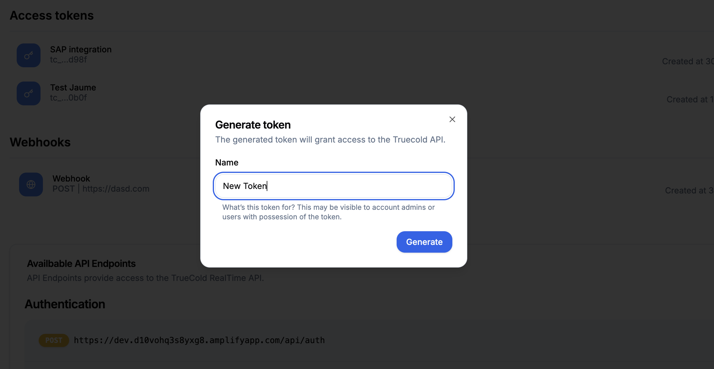

Follow this steps to generate your API credentials and make your first call in under five minutes.

### 1. Generate API credentials

Log in TrueCold and head to *Account* page. Under *API credentials* tab, click on the button that says *Generate token*. Give it a name and click on *Generate*. You will see the **API key**. Make sure you save it, because this will be the only time you will see it.

<Frame caption="Generate new API credentials from TrueCold Integrations Tab">
  
</Frame>

### 2. Test your credentials [WIP]

We are currently working on an in-docs interactive playground so you can test your keys and all of the API's endpoints without leaving the docs.

### All done

Congrats! You’ve set up your TrueCold API credentials and made your first authenticated API call. Need support or want to give some feedback? Drop an email to our CTO [support@truecold.io](mailto:support@truecold.io).